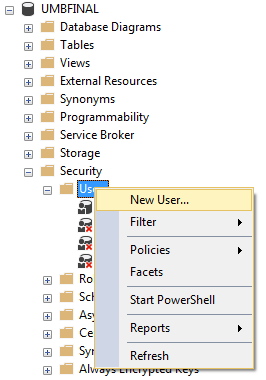
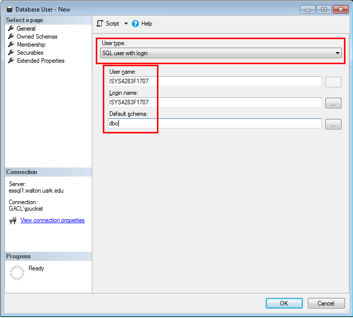
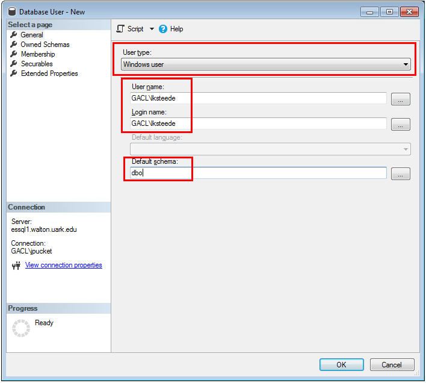

# Permissions for Microsoft SQL Server

This is a brief tutorial on how to grant access and permissions to a
Microsoft SQL Server database.

Firstly, make sure you understand the difference between
[authentication and authorization][authentication-authorization].
Authentication is handled on the server layer,
and authorization is handled on the database layer.

## Table of Contents

1. [Authentication](#authentication)
    1. [Server](#server-login)
        * [Windows](#windows-authentication)
        * [SQL](#sql-authentication)
    1. [Database](#database-user)
1. [Authorization](#authorization)
    * [`GRANT` statements](#grant-statements)
    * [`ROLE` memberships](#roles)
        * Built-In
        * Custom

## Authentication

Because an SQL Server instance may host multiple databases,
there is a two-step process to setting up authentication:
first the [server layer](#server-login)
and then the [database layer](#database-user).

There are two methods by which to authenticate:
[Windows](#windows-authentication) or [SQL](#sql-authentication).

### Server Login

There is no authorization on the server layer,
this is managed exclusively on the database layer.

The server layer has the single responsibility of verifying usernames and passwords.

#### Windows Authentication

If an SQL Server is joined to an Active Directory domain, then
users of that domain may login automatically with their Windows credentials.
There is no need to provide a password with this method.

This is the preferred method of connection for individual users in a domain.

Logins may be created directly for a specific user,
or logins may be created for an Active Directory security group.
In the latter case, users will be authenticated by virtue of group membership.
This provides a useful abstraction layer for managing access to server logins.

#### SQL Authentication

The login must be created with a unique username and a password.

This is the preferred method for service accounts, such as a web application.

If either the server or client is not joined to a domain,
then this is the only method by which to authenticate users.

### Database User

Once login credentials have been successfully verified on the server layer,
now those *server users* must be mapped to locally created *database users*.

Expand database > `Security` and right click `Users` then select `New User...`

The database username can be whatever you want, but the login name must match
exactly the account's server login.
In order to keep things straight, I recommend making these the same.
The default schema for a database is `dbo`

If you want to add a Windows user, then select that from the dropdown.
In this case, the user's server login is of the form `WORKGROUP\username`

*Note* that even if a user has a login by virtue of a AD security group,
you can (usually should) still reference their individual account as the login.

## Authorization

Once the database user has been created, then data permissions can be granted.

### Grant Statements

Permissions have fine granularity which can be specified to a column,
and even finer with the use of stored procedures.
Read the [documentation on grant statements][grant-docs].

### Roles

Roles are analogous to security groups.
Users can be members of roles, and roles can be members of other roles.
Roles are granted specific permissions,
and users that are a member of that role inherit those permissions.

There are a number of [built-in roles][built-in-role-docs]
provisioned with common privileges.

You may also define your own roles and grant them custom permissions.

[authentication-authorization]:https://serverfault.com/q/57077/331028
[grant-docs]:https://docs.microsoft.com/en-us/sql/t-sql/statements/grant-transact-sql
[built-in-role-docs]:https://msdn.microsoft.com/library/ms189612.aspx
